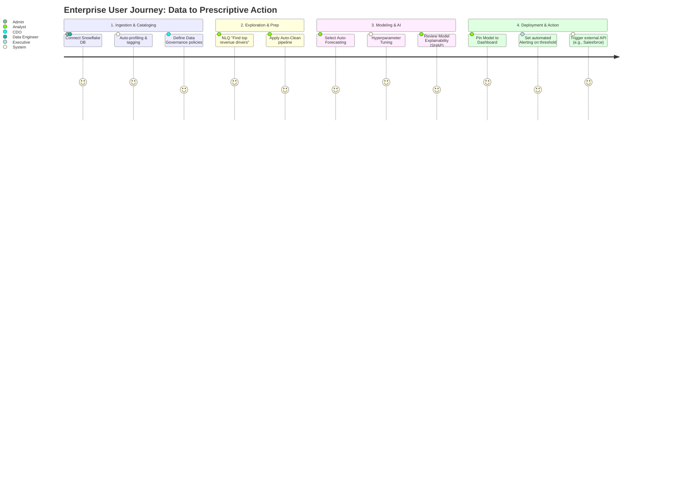
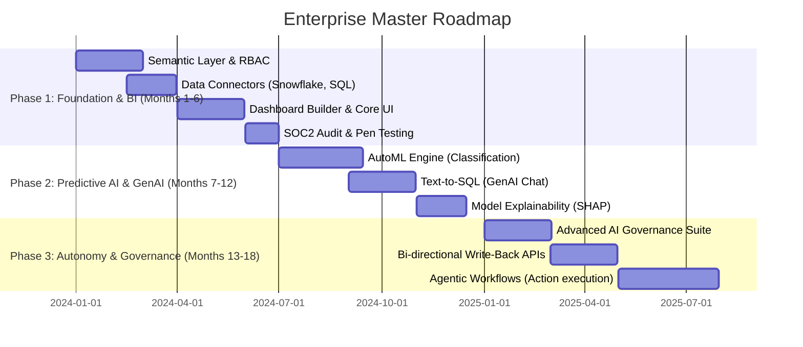

# Enterprise AI Analytics & Prediction Platform
## Software Requirement Specification (SRS) & Master Architecture Plan

---

## 1. Executive Summary

### What problem this platform solves
Modern enterprises are drowning in fragmented data distributed across multiple clouds, on-premise silos, and legacy systems. Extracting actionable insights and deploying predictive ML models requires elite, scarce data science talent and months of development. The Enterprise AI Analytics & Prediction Platform resolves this by delivering a unified, zero-code environment that democratizes advanced analytics, empowering business users to generate real-time predictive insights autonomously while maintaining strict enterprise governance.

### Why companies need it
To survive in hyper-competitive markets, Fortune 500 companies cannot rely on retroactive BI reporting. They require immediate, prescriptive foresight. This platform allows enterprises to pivot from "What happened last quarter?" to "What will happen next week, and what is the optimal strategy to maximize ROI?"

### Market opportunity
The Global AI in Big Data market is expanding at a >25% CAGR. With organizations aggressively seeking to reduce reliance on expensive bespoke modeling and monolithic, inflexible BI legacy tools, this platform captures the lucrative mid-market to enterprise-level gap by offering a consumer-grade user experience backed by enterprise-grade infrastructure.

### Business value & Competitive advantages
- **Agility**: Rapid deployment of ML models (minutes vs. months).
- **Total Cost of Ownership (TCO)**: Eliminates the need for stitched-together toolchains (ETL + BI + ML + Data Catalog).
- **Enterprise Trust**: Uncompromising security, AI governance, and explainability out-of-the-box.
- **Interoperability**: Agnostic native connectors (AWS, Azure, GCP, Snowflake, ERPs, CRMs).

---

## 2. Product Vision & Strategy

### Vision
To be the authoritative, autonomous neural network of the modern enterprise—ingesting all organizational data streams to continuously optimize decision-making and business workflows in real-time.

### Mission
To democratize AI and predictive analytics, bridging the gap between complex data science and business operations through an intuitive, secure, and highly governed platform.

---

## 3. Business Requirements

### Strategic Requirements
- **BR-1**: The platform must support true multi-tenancy with physical or logical data separation capabilities based on tiering (SaaS vs. VPC deployment).
- **BR-2**: Must provide a "No-Code" interface for 90% of use cases, with an optional "Low-Code/Pro-Code" Python/R notebook environment for power users.
- **BR-3**: Must achieve an aggressive Time-to-Value (TTV) metric: users must connect a source and generate a dashboard within 15 minutes.

### Constraints & Dependencies
- **Cloud Dependency**: Architecture must be cloud-agnostic (Kubernetes-based) to prevent vendor lock-in.
- **Cost Management**: Automated spin-down of idle compute resources (GPU/CPU) to maintain SaaS profit margins.
- **LLM Agnosticism**: Must abstract foundational models to allow switching between OpenAI, Anthropic, or self-hosted open-weight models (Llama 3, Mistral) based on cost and compliance needs.

### Success Metrics (KPIs)
- **Financial**: Annual Recurring Revenue (ARR), Net Revenue Retention (NRR > 120%).
- **Operational**: Infrastructure cost per tenant < 15% of ARR.
- **Usage**: Daily Active Users (DAU), number of models trained per week, query execution volume.

---

## 4. Stakeholders

| Stakeholder | Focus Area | Success Criteria |
| :--- | :--- | :--- |
| **C-Suite (CEO, CFO)** | Strategic ROI, Cost Management | Real-time executive dashboards, clear ROI on AI investment. |
| **Chief Data Officer (CDO)** | Governance, Data Quality | Enforced data lineage, cataloging, and compliance. |
| **Chief Info. Security Officer (CISO)** | Security, Access Control | Zero-trust architecture, SOC2 compliance, audit logs. |
| **Data Scientists / Engineers** | Flexibility, Advanced Tooling | API access, Python SDKs, ability to bypass UI for complex tasks. |
| **Business Analysts** | Ease of Use, Speed | Natural language querying, drag-and-drop ML forecasting. |
| **IT Admins / DevOps** | Deployability, Maintenance | Automated CI/CD, Infrastructure as Code (Terraform), observability. |

---

## 5. User Personas

1. **"Analyst Alex" (Business Intelligence Lead)**: Needs to rapidly generate ad-hoc reports and forecasts without waiting for IT. Pain point: Legacy BI tools are too slow and rigid.
2. **"Data Engineer Dan"**: Responsible for maintaining pipelines. Pain point: Broken pipelines and schema drift. Needs automated anomaly detection and alerting.
3. **"Governance Grace" (Compliance Officer)**: Ensures no PII is leaked to LLMs or public models. Needs robust data masking and PII redaction rules.
4. **"Executive Emily" (VP of Sales)**: Needs an app-like experience on her iPad to check daily forecasts and ask natural language questions about regional performance.

---

## 6. Comprehensive Use Cases

- **UC-1: Zero-ETL Data Integration**: Connect to Snowflake; the system automatically maps relationships, infers data types, and suggests analytical views without data movement.
- **UC-2: Auto-Data Cleansing**: Upload a dirty CRM export; AI identifies outliers, imputes missing values, and normalizes categorical variables automatically.
- **UC-3: Conversational Analytics (NLQ)**: User types "Show rolling 30-day churn by region, exclude trial users." System parses intent, generates SQL, executes, and renders a time-series chart.
- **UC-4: Explainable AI (XAI) Forecasting**: Train an XGBoost model on inventory data. The system provides SHAP value charts explaining exactly *why* a specific SKU is predicted to stock out.
- **UC-5: PII Redaction**: Connect to an HR database; the system automatically identifies Social Security Numbers and masks them for all non-privileged roles.
- **UC-6: CI/CD for Models (MLOps)**: An updated dataset triggers an automatic retraining of a production model; system shadow-tests it before promoting it to production.

---

## 7. User Journey: The Analytics Lifecycle

---

## 8. Functional Modules & Requirements

### Core Architecture Modules
1. **Integration Fabric**:
   - Universal JDBC/ODBC connectors.
   - Native API connectors (Salesforce, SAP, Workday).
   - Real-time streaming ingestion (Kafka, Kinesis).
2. **Semantic Layer & Data Catalog**:
   - Centralized metric definition (e.g., standardizing the definition of "Active User").
   - Automated data lineage tracking (origin to dashboard).
3. **AI/ML Engine (AutoML & MLOps)**:
   - Automated feature engineering.
   - Multi-algorithm training (Random Forest, Gradient Boosting, LSTMs, Transformers).
   - Champion/Challenger (A/B) model deployment.
4. **Conversational Interface (GenAI Layer)**:
   - RAG (Retrieval-Augmented Generation) architecture for contextual Q&A.
   - Text-to-SQL / Text-to-Python translation with deterministic validation.
5. **Visualization Canvas**:
   - Real-time WebGL/Canvas rendering for massive datasets.
   - Configurable drill-down and cross-filtering.
6. **Workflow & Orchestration Engine**:
   - DAG-based task scheduling (similar to Airflow) for report generation and model retraining.

---

## 9. Non-Functional Requirements: Scalability & Performance

### Scalability Planning
- **Compute Layer**: Kubernetes-based microservices. Auto-scaling groups based on CPU/Memory and custom metrics (e.g., active query count).
- **Storage Layer**: Separation of compute and storage. Use of object storage (S3) for data lakes and NVMe SSDs for caching layers (Redis/Memcached).
- **ML Workloads**: Dynamic provisioning of GPU nodes (NVIDIA A100/H100) exclusively during model training phases, scaling down to CPU for inference to optimize costs.

### Performance Requirements
- **UI Responsiveness**: Initial page load < 1.5s (95th percentile).
- **Query Latency**: In-memory cached queries < 200ms. Ad-hoc complex queries dependent on source DW, but platform parsing overhead must be < 50ms.
- **Concurrency**: Must support 10,000+ concurrent active users per region without degradation.

### Cloud Readiness
- **Infrastructure as Code (IaC)**: 100% Terraform/Pulumi managed environments.
- **Multi-Cloud**: Helm charts designed to deploy seamlessly across EKS (AWS), GKE (GCP), and AKS (Azure).
- **Stateless Services**: All API and application servers must be entirely stateless to allow instant horizontal scaling.

---

## 10. Security & Compliance Requirements

### Enterprise Security Architecture
- **Identity & Access Management (IAM)**:
  - SAML 2.0 / OIDC integration (Okta, Azure AD).
  - Multi-Factor Authentication (MFA) enforcement.
  - Granular Role-Based Access Control (RBAC) and Attribute-Based Access Control (ABAC).
- **Data Protection**:
  - **At Rest**: AES-256 encryption via AWS KMS / HashiCorp Vault. BYOK (Bring Your Own Key) support for Enterprise tiers.
  - **In Transit**: TLS 1.3 for all external and internal microservice communication (Service Mesh / Istio).
  - **Row-Level & Column-Level Security (RLS/CLS)**: Enforced dynamically at the query execution engine.

### Compliance Certifications Required
- **SOC 2 Type II**: Continuous auditing of security controls.
- **ISO 27001**: Information security management.
- **GDPR & CCPA**: Right-to-be-forgotten APIs, data residency controls (e.g., EU data strictly remains in EU data centers).
- **HIPAA**: BAA capability and PHI masking.

---

## 11. Data Governance & Architecture

- **Data Lineage**: Visual graphs showing how a specific column in a dashboard was derived from raw database tables.
- **Automated PII Detection**: Scanning incoming metadata/data for sensitive information (SSN, credit cards) and applying masking policies (e.g., `XXX-XX-1234`).
- **Data Quality Monitoring**: Alerts for schema drift, null-value spikes, or statistical distribution shifts in critical columns.
- **Version Control for Data**: "Time-travel" capabilities to query data as it existed at a specific point in time (leveraging Apache Iceberg/Delta Lake patterns).

---

## 12. AI Governance & Ethical AI

Fortune 500 companies cannot deploy "black box" models.
- **Model Explainability (XAI)**: Mandatory generation of SHAP/LIME values for all predictive models to explain feature importance.
- **Bias & Fairness Monitoring**: Automated checks for disparate impact across protected classes (e.g., gender, race in HR or credit models).
- **LLM Guardrails**:
  - **Input Sanitization**: Stripping PII before prompts are sent to external LLMs.
  - **Output Determinism Validation**: Executing LLM-generated SQL in a sandboxed, read-only transaction to ensure it doesn't drop tables or hallucinate data.
  - **Prompt Injection Defense**: Robust filtering to prevent users from jailbreaking the SQL-generation engine.

---

## 13. Enterprise Integrations

- **ITSM & Alerting**: ServiceNow, PagerDuty, Jira (for automated ticket creation upon data anomaly detection).
- **Communication**: Slack, Microsoft Teams (for distributing insights and alerts).
- **CRM/ERP**: Salesforce, SAP, Oracle (native bi-directional syncing for write-back capabilities).
- **Data Catalogs**: Collibra, Alation (syncing metadata and tags).

---

## 14. Risk Assessment & Mitigation

| Risk Category | Identified Risk | Impact | Probability | Mitigation Strategy |
| :--- | :--- | :--- | :--- | :--- |
| **Security** | Multi-tenant data bleed. | CRITICAL | Low | Strict logical isolation (schema-per-tenant) or dedicated VPCs for high-tier clients. |
| **AI / ML** | LLM Hallucinations producing false reports. | HIGH | Medium | RAG architecture grounding all answers in strictly defined semantic layers; explicit disclaimers; deterministic validation of all generated code. |
| **Operational** | Runaway cloud compute costs from AutoML. | HIGH | High | Hard limits on training iterations; cost-quota alerts per tenant; aggressive resource culling. |
| **Integration** | Source database downtime causing dashboard failure. | MEDIUM | Medium | Intelligent caching of last-known-good data state; robust retry mechanisms with exponential backoff. |
| **Compliance** | Inadvertent ingestion of PHI/PII into public LLMs. | CRITICAL | Low | Edge-layer PII redaction proxy; option for localized open-source LLM processing. |

---

## 15. Future Expansion & Enterprise Roadmap

---
*Document Status: MASTER APPROVED*
*Architecture Level: Fortune 500 Enterprise SaaS Standard*
