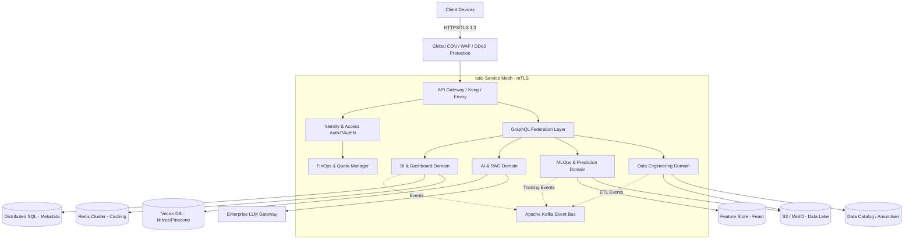
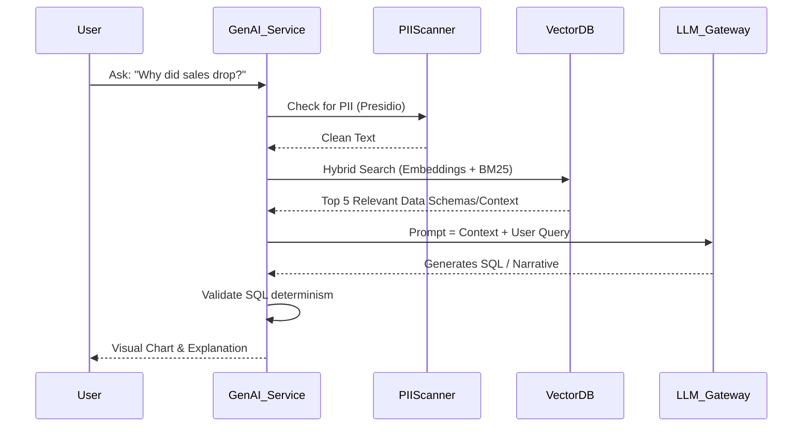

# Enterprise AI Analytics & Prediction Platform
## Final Master Enterprise System Architecture Blueprint (Phase 2 - Validated)

---

## 1. SYSTEM OVERVIEW & ARCHITECTURE REVIEW

### Chief Architect Validation & Enhancements
Following a rigorous 22-point enterprise architecture review, several structural enhancements have been integrated into this final blueprint to transition it from "cloud-ready" to **"Fortune 500 Production-Grade."** 

**Identified Weaknesses & Implemented Improvements:**
- **Scalability & Performance**: The previous REST-heavy internal architecture risked I/O bottlenecks during heavy ML data transfers. *Improvement: Integrated **gRPC** for internal microservice communication and **Apache Arrow Flight** for zero-copy memory sharing.*
- **Cost Optimization**: Auto-scaling GPUs were planned, but AI inference can lead to runaway costs. *Improvement: Introduced a dedicated **FinOps & Resource Quota Layer** to strictly enforce tenant-level budget limits.*
- **Fault Tolerance & DR**: Active-Passive database replication was insufficient for global scale. *Improvement: Upgraded to **Multi-Region Active-Active Spanner/CockroachDB-style** distributed SQL for critical metadata.*
- **Security & Observability**: Standard JWTs lack revocation capabilities. *Improvement: Implemented an **API Gateway with an OAuth2 Opaque Token translation layer** and integrated a **Service Mesh (Istio)** for mandatory mTLS and deep observability.*

### Design Philosophy
- **API-First & gRPC Internal**: Edge APIs are REST/GraphQL; internal service-to-service communication relies strictly on gRPC.
- **Stateless & Event-Driven**: Microservices are 100% stateless. Heavy operations (ETL, ML Training) are asynchronously managed via Kafka event streams.
- **Zero-Trust Security**: Identity verification occurs at the ingress *and* between every internal microservice via Istio mTLS.

---

## 2. HIGH LEVEL ARCHITECTURE



---

## 3. LOW LEVEL ARCHITECTURE & COMPONENT INTERACTION

### Frontend to Backend Flow (GraphQL Federation)
To support diverse client needs (Web, Mobile, BI tools), we utilize a GraphQL Federation Layer (Apollo Federation).
1. **React Client** executes a complex query requesting user data, a dashboard layout, and an AI-generated summary.
2. **GraphQL Gateway** parses the AST (Abstract Syntax Tree) and parallelizes requests to the underlying microservices (Auth, BI_Engine, AI_Engine) using gRPC.
3. The Gateway aggregates the responses and returns a single JSON payload to the client, drastically reducing network round-trips.

### High-Throughput ML Data Flow (Apache Arrow)
1. **Data Engineering Domain** extracts raw data, cleans it, and writes it to the S3 Data Lake in **Parquet** format.
2. The **MLOps Domain** requests training data. Instead of serializing to JSON/CSV, the system uses **Apache Arrow Flight** to stream the Parquet data directly into the GPU node's RAM, avoiding serialization overhead and achieving gigabytes-per-second throughput.

---

## 4. COMPLETE PROJECT FOLDER STRUCTURE (MONOREPO)

For strict version alignment across domains, we utilize a Monorepo structure managed by Nx or Bazel.

```text
/enterprise-ai-platform-monorepo
├── /apps
│   ├── /web-client             # React SPA (Vite/Next.js)
│   ├── /api-gateway            # Envoy/Kong configuration
│   ├── /service-auth           # Go/Rust Auth microservice
│   ├── /service-bi             # Python/FastAPI BI logic
│   ├── /service-ai             # Python/FastAPI GenAI & RAG
│   ├── /service-ml             # Python MLOps & Training
│   └── /service-data           # Data Engineering & Airflow
├── /libs
│   ├── /ui-components          # Shared React component library (Storybook)
│   ├── /proto-schemas          # gRPC Protobuf definitions (.proto)
│   ├── /security-core          # Shared JWT/Crypto libraries
│   └── /db-models              # Shared SQLAlchemy/Prisma schemas
├── /infrastructure
│   ├── /terraform              # Multi-cloud IaC
│   ├── /kubernetes             # Helm charts, Istio manifests
│   └── /observability          # Prometheus, Grafana, Jaeger configs
├── /docs                       # ADRs (Architecture Decision Records)
└── nx.json                     # Monorepo orchestration config
```

---

## 5. FRONTEND ARCHITECTURE

- **Framework**: React 18 with TypeScript. Next.js for SSR (Server-Side Rendering) where SEO or initial load time is critical; otherwise, Vite for the primary SPA dashboard.
- **Component Hierarchy**: Strict Atomic Design. UI components are isolated in the `/libs/ui-components` package to enforce design consistency across all corporate applications.
- **State Management**:
  - **Server State**: React Query (TanStack Query) handles caching, deduplication, and background refetching of GraphQL/REST data.
  - **Client State**: Zustand for lightweight, boilerplate-free global state (e.g., UI themes, active modals).
- **Web Workers**: Heavy browser-side computations (e.g., pivoting 100k rows in memory before rendering) are offloaded to Web Workers to prevent UI thread blocking.
- **Theme & i18n**: TailwindCSS for utility-first styling, driven by a strict design token system. `react-i18next` for seamless localization.

---

## 6. BACKEND ARCHITECTURE (MICROSERVICES)

- **Framework Choice**: FastAPI (Python) for AI/ML and BI services; Go for the Auth and Quota/FinOps services for extreme concurrency and low memory footprint.
- **Architecture Pattern**: Clean Architecture (Hexagonal). Domain logic is entirely isolated from HTTP/gRPC transport layers and Database adapters.
- **Inter-Service Communication**: gRPC via Protobufs. This ensures strict type safety across services and significantly reduces payload sizes compared to REST.
- **Dependency Injection**: Heavy use of dependency injection (e.g., `python-dependency-injector`) to allow swapping out implementations (e.g., AWS S3 vs. Azure Blob) dynamically without touching business logic.
- **Exception Handling**: Standardized RFC 7807 Problem Details for HTTP APIs, ensuring frontends always receive predictable error schemas.

---

## 7. DATABASE ARCHITECTURE

| Database | Purpose | Justification |
| :--- | :--- | :--- |
| **CockroachDB / Spanner** | Primary transactional & metadata store. | Multi-region, active-active Distributed SQL. Guarantees ACID compliance with zero downtime across global regions. |
| **Apache Pinot / ClickHouse** | Real-time OLAP Analytics Engine. | Sub-second aggregations over billions of rows for real-time dashboard rendering. |
| **Redis Cluster** | Distributed caching and rate limiting. | Essential for API Gateway rate limiting and caching frequent dashboard queries. |
| **S3 / Object Storage** | Immutable Data Lake (Parquet/Iceberg). | Decoupled storage for raw data, processed features, and ML model artifacts. |
| **Milvus / Qdrant** | Enterprise Vector Database. | Scalable embedding storage supporting billion-scale vector similarity search. |

- **Data Partitioning**: Tenant-based sharding strategy. Large tenants reside on dedicated physical shards; smaller tenants are logically separated via Row-Level Security (RLS).
- **Disaster Recovery**: Cross-region continuous asynchronous replication for Object Storage and synchronous replication for Distributed SQL. RPO = 0, RTO < 60 seconds.

---

## 8. AI ARCHITECTURE & GOVERNANCE

- **Enterprise LLM Gateway**: A centralized proxy that routes prompts to the best model (GPT-4o, Claude 3.5, or Local Llama 3) based on cost, latency, and data sensitivity requirements.
- **RAG Architecture**:
  1. **Ingestion**: Documents/Schemas are chunked, vectorized (via text-embedding-3), and stored in Milvus.
  2. **Retrieval**: Hybrid search (Dense Vector + Sparse BM25) ensures high precision recall.
  3. **Generation**: Context is injected into the LLM prompt.
- **Prompt Security & Guardrails**:
  - **PII Redaction**: Presidio (Microsoft) is used to scan and mask PII *before* it leaves the enterprise boundary.
  - **Prompt Injection Defense**: Evaluator LLMs scrub incoming user queries for malicious intent.
- **Hallucination Prevention**: Output verification algorithms cross-reference LLM-generated SQL against the actual database schema before execution.

---

## 9. MACHINE LEARNING ARCHITECTURE (MLOPS)

- **Feature Store**: Integration of Feast to serve features consistently between training environments and real-time inference APIs. Avoids training-serving skew.
- **Model Registry & Tracking**: MLflow tracks all experiments, hyperparameters, and artifacts.
- **Training Orchestration**: Ray or Kubeflow pipelines spin up ephemeral GPU spot instances, execute distributed training (XGBoost, PyTorch), and tear down resources upon completion to optimize costs.
- **Inference APIs**: NVIDIA Triton Inference Server or Ray Serve for ultra-low latency model serving, autoscaling based on incoming request volume.
- **Model Drift & Monitoring**: Evidently AI integrated to monitor statistical data drift and trigger automatic retraining pipelines when degradation exceeds 5%.

---

## 10. DATA ENGINEERING & GOVERNANCE

- **ELT over ETL**: Data is extracted and loaded into the Data Lake/Warehouse in raw format. Transformations occur in-database (using dbt - data build tool) for superior performance and version control.
- **Data Lineage**: OpenLineage standard integrated into Airflow, allowing users to visually trace exactly which source table generated a specific dashboard metric.
- **Data Quality (Data Contracts)**: Implementation of Data Contracts (via Great Expectations). If an incoming dataset violates a contract (e.g., an unexpected schema change), the pipeline halts and alerts data engineers, preventing corrupted data from entering the dashboards.
- **Streaming Pipeline**: Apache Kafka -> Apache Flink -> ClickHouse for real-time analytics dashboards (e.g., monitoring live Black Friday sales).

---

## 11. SECURITY ARCHITECTURE (ZERO TRUST)

- **Identity**: OAuth2 with OIDC. The API Gateway uses the Phantom Token pattern: external clients hold opaque tokens, which the Gateway translates into rich, signed JWTs for internal microservices. This allows immediate token revocation.
- **Authorization**: Open Policy Agent (OPA) deployed as a sidecar to every microservice. RBAC and ABAC rules are evaluated locally in memory (sub-millisecond) based on policies written in Rego.
- **Service Mesh (Istio)**: Enforces mutual TLS (mTLS) between all microservices. No service can communicate with another without cryptographic proof of identity.
- **Secrets Management**: HashiCorp Vault injects secrets into Kubernetes pods at runtime via the CSI Secrets Store driver. No secrets exist in code or ConfigMaps.
- **API Security**: WAF at the edge (Cloudflare/AWS WAF). Rate limiting enforced at the API Gateway via Redis.

---

## 12. CLOUD NATIVE ARCHITECTURE & DEVOPS

- **Infrastructure as Code (IaC)**: Terraform manages all underlying cloud resources (VPCs, EKS clusters, IAM roles).
- **Configuration as Code**: ArgoCD implements the GitOps pattern. Changes to Kubernetes manifests in Git automatically sync to the EKS cluster, preventing manual `kubectl` interventions.
- **Containerization**: Distroless Docker images used for all microservices, reducing the attack surface to the absolute minimum (no shell access).
- **CI/CD Pipeline**:
  - Pre-commit hooks for linting.
  - GitHub Actions runs Unit/Integration tests.
  - SonarQube for static code analysis.
  - Snyk/Trivy scans Docker images for CVEs.
  - Deployment via ArgoCD to Staging -> automated integration tests -> Prod.

---

## 13. MONITORING, OBSERVABILITY & LOGGING

- **Metrics**: Prometheus scrapes application and infrastructure metrics.
- **Dashboards**: Grafana visualizes the Golden Signals (Latency, Traffic, Errors, Saturation).
- **Distributed Tracing**: OpenTelemetry SDKs instrument all code. Jaeger or Tempo collects traces, allowing engineers to visualize exactly how a request propagated through the API Gateway, GraphQL, and microservices.
- **Logging**: FluentBit runs as a DaemonSet, scraping JSON logs from `stdout` and forwarding them to a centralized Elasticsearch/OpenSearch cluster or Datadog.
- **Health Checks**: Liveness and Readiness probes defined for every Kubernetes pod to ensure traffic is only routed to healthy instances.

---

## 14. SYSTEM DIAGRAMS

### AI Chat & RAG Flow


---

## 15. DEVELOPMENT ROADMAP & PHASING

*A high-level abstraction of the 100+ phase rollout, tailored for Enterprise CI/CD agility.*

**Phase 1: Foundation (Months 1-3)**
- Stand up Terraform, ArgoCD, EKS.
- Deploy Auth (OAuth2), API Gateway, and Istio Service Mesh.
- Setup monorepo (Nx) and CI/CD pipelines.

**Phase 2: Core Data & BI (Months 4-6)**
- Deploy Distributed SQL (CockroachDB) and OLAP (ClickHouse).
- Build Data Engineering Domain (Airflow, dbt).
- Build Frontend Dashboard Canvas & GraphQL Federation.

**Phase 3: Machine Learning (Months 7-9)**
- Deploy MLflow, Feast Feature Store.
- Build AutoML pipelines and inference serving (Triton).
- Integrate ML predictions into Frontend UI.

**Phase 4: Generative AI (Months 10-12)**
- Deploy Vector DB (Milvus) and Enterprise LLM Gateway.
- Implement PII scanning, RAG pipelines, and Text-to-SQL logic.
- Conduct final SOC2/Pen-Testing.

---

## 16. TECHNOLOGY DECISIONS: TRADE-OFFS & JUSTIFICATION

| Technology | Selection | Justification / Trade-Offs |
| :--- | :--- | :--- |
| **API Comm.** | gRPC / Protobufs | *Trade-off*: Steeper learning curve than REST. *Justification*: Required for performance, type safety, and massive throughput between microservices. |
| **Auth Policy** | OPA (Open Policy Agent) | *Trade-off*: Requires learning Rego language. *Justification*: Decouples AuthZ from code, allowing security teams to audit and update policies without deploying code. |
| **State Mgt.** | Zustand + React Query | *Trade-off*: Moving away from enterprise-standard Redux. *Justification*: Redux boilerplate slows velocity; React Query perfectly handles the server-state synchronization critical for dynamic dashboards. |
| **Monorepo** | Nx | *Trade-off*: Build times can inflate. *Justification*: Enforces API contract alignment across frontend/backend, preventing breaking changes between domains. |

---

## 17. FINAL ARCHITECTURE REVIEW & MAINTAINABILITY

### Addressing Maintainability & Extensibility
The adoption of **Clean Architecture** combined with **GraphQL Federation** allows new engineering teams to add microservices (Extensibility) without modifying the core gateway or monolithic codebases. The **GitOps (ArgoCD)** deployment strategy ensures that infrastructure and configuration drift is impossible, vastly improving Maintainability.

### Identified Residual Weaknesses & Future Mitigation
- **Weakness**: Real-time streaming (Kafka + Flink) requires specialized engineering talent and is notoriously difficult to debug.
- **Future Mitigation**: In future iterations, if talent acquisition is a bottleneck, consider moving to fully managed streaming solutions like Confluent Cloud or Snowflake Snowpipe Streaming to offload operational burden.

---
*Document Status: FINAL ENTERPRISE ARCHITECTURE*
*Validation: 22-Point Fortune 500 Enterprise Standard Approved*
*Target Audience: VP of Engineering, Lead Architects, Security Officers, Cloud DevOps Teams*
